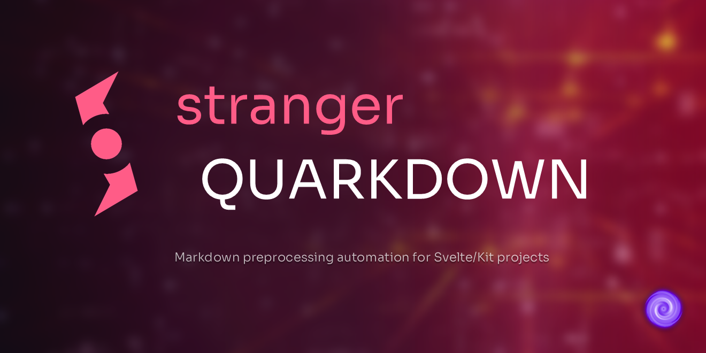

<div align="center">



[](https://github.com/Sup2point0/stranger-quarkdown/actions/workflows/test.yml)
[](https://github.com/Sup2point0/stranger-quarkdown/actions/workflows/site.yml)

</div>

---

**Stranger Quarkdown** (*Squarkdown*) is a successor to [*Quarkdown*](https://github.com/Sup2point0/Quarkdown), for integration with [Svelte<sup>↗</sup>](https://svelte.dev), [SvelteKit<sup>↗</sup>](https://svelte.dev/docs/kit/introduction) and [MDsveX<sup>↗</sup>](https://mdsvex.pngwn.io).

Write content for a site with [Squarkdown-Flavoured Markdown](docs/walkthrough.md) anywhere in your project repo, then use Squarkdown to automatically export them to `.svx` files in your SvelteKit project directory.


<br>


## Features

### Core
- Automates several parts of the build process for SvelteKit projects
- Multiple configuration options and Rake tasks for flexibility
- Intelligently handles directories for more versatile navigation

### Extra
- Moves assets from a different folder to the SvelteKit `static/` directory
- Collects fonts to build the [Google Fonts<sup>↗</sup>](https://fonts.google.com) `<link>` tag
- Collects global `.scss` files to build an `scss-config.js` file

### Future
- Search root directory without recursively searching every directory
- Allow arbitrary JSON data in squark charm
- Correct internal relative links to correct absolute links in production


<br>


## Directory

> I mean, these should be pretty self-explanatory, but here you go anyway ;)

| folder | notes |
| :----- | :---- |
| [`squarkdown`](squarkdown/) | source code |
| [`cli`](cli/) | source code (CLI) |
| [`tests`](tests/) | unit tests |
| [`docs`](docs/) | documentation |
| [`site`](site/) | project site |
| [`.github/scripts`](.github/scripts/) | helper scripts for generating docs and site |


<br>


## Usage

> [!Tip]
> See [Using Squarkdown in a SvelteKit project](docs/walkthrough.md) for a full detailed walkthrough.

This project is designed to be used as a [Git submodule](https://git-scm.com/book/en/v2/Git-Tools-Submodules).

Add it to a repo:

```console
git submodule add https://github.com/Sup2point0/stranger-quarkdown
```

Make sure you’ve got your [repo config](docs/squarkup-config.md) in `./.squarkdown/squarkup.json` if needed.

Run `rake` in the `./stranger-quarkdown/` directory to start the squarkup process. You can add this to your `npm run build` definition in `package.json`, so that it executes whenever you build the site:

```diff
  {
    "scripts": {
+     "build": "cd stranger-quarkdown && rake && cd .. && vite build"
    }
  }
```

Squarkdown will recursively look for all `.md` files starting from the root of the repo, and export them to `.svx` files in `src/routes`.

Many additional configurations are available to customise this process, although the defaults should cover most projects.


<br>


## License

MIT. It’s not that even that good code, lmao.


<br>
