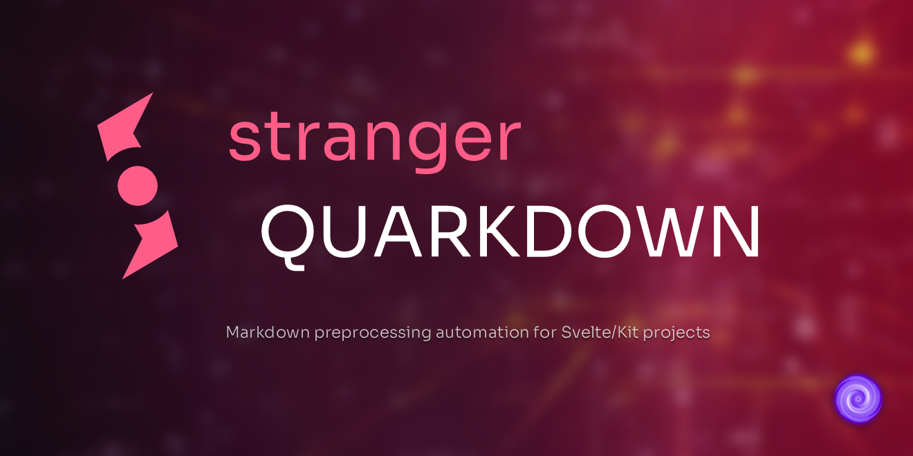

<div align="center">



[](https://github.com/Sup2point0/stranger-quarkdown/actions/workflows/test.yml)
[](https://github.com/Sup2point0/stranger-quarkdown/actions/workflows/site.yml)

</div>

---

<div align="center">

[Quickstart](docs/walkthrough/quickstart.md) · [Docs](docs/) · [Site](https://sup2point0.github.io/stranger-quarkdown/docs)

</div>

**Stranger Quarkdown** (*Squarkdown*) is a successor to [*Quarkdown*](https://github.com/Sup2point0/Quarkdown), for integration with [Svelte<sup>↗</sup>](https://svelte.dev), [SvelteKit<sup>↗</sup>](https://svelte.dev/docs/kit/introduction) and [MDsveX<sup>↗</sup>](https://mdsvex.pngwn.io).

Write content for a site with [Squarkdown-Flavoured Markdown](docs/walkthrough/quickstart.md) anywhere in your project repo, then use Squarkdown to automatically export them to `.svx` files in your SvelteKit project directory.


<br>


## Features

### Core
- Automates several parts of the build process for SvelteKit projects
- Multiple configuration options and Rake tasks for flexibility
- Intelligently handles directories for more versatile navigation

### Extra
- Moves assets from a different folder to the SvelteKit `static/` directory
- Collects fonts to build the [Google Fonts<sup>↗</sup>](https://fonts.google.com) `<link>` tag
- Collects global `.scss` files to build an `scss-config.js` file

### Future
- Search root directory without recursively searching every directory
- Correct internal relative links to correct absolute links in production


<br>


## Usage

> [!Tip]
> See [Using Squarkdown in a SvelteKit project](docs/walkthrough/quickstart.md) for a full walkthrough.

Add Squarkdown to your project as a [Git submodule](https://git-scm.com/book/en/v2/Git-Tools-Submodules):

```bash
project> git submodule add https://github.com/Sup2point0/stranger-quarkdown
```

Setup:

```bash
stranger-quarkdown> rake init
```

Run:

```bash
stranger-quarkdown> rake squark
```

Squarkdown will look for `.md` files in your repo with a `<!-- #SQUARK live! -->` [squark](docs/reference/squarks.md), and export them to `.svx` files in `src/routes`.

Many additional configurations are available (although the defaults should actually cover most projects!).

For more, visit [the docs](docs/) in this repo, or view them on [the website](https://sup2point0.github.io/stranger-quarkdown/docs).


<br>


## Licence

MIT. The code’s not even that good, lmao.


<br>
