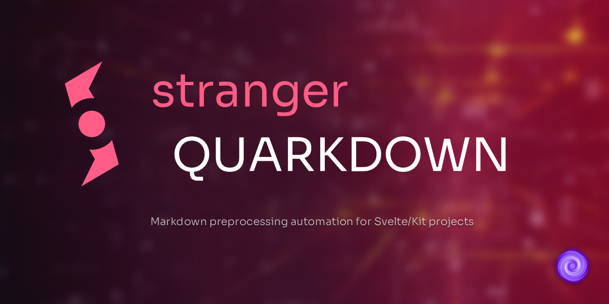

<div align="center">



[](https://github.com/Sup2point0/stranger-quarkdown/actions/workflows/test.yml)
[](https://github.com/Sup2point0/stranger-quarkdown/actions/workflows/site.yml)

</div>

---

<div align="center">

[Docs](docs/) · [Quickstart](docs/walkthrough/quickstart.md) · [FAQ](FAQ.md) · [Changelog](CHANGELOG.md) · [Site](https://sup2point0.github.io/stranger-quarkdown/docs)

</div>

> [!Warning]
> Squarkdown has been freshly rewritten in Rust. It’s not quite battle-tested just yet, but it’s almost there!

**Stranger Quarkdown** (*Squarkdown*) is a build tool for [SvelteKit<sup>↗</sup>](https://svelte.dev/docs/kit/introduction) and [MDsveX<sup>↗</sup>](https://mdsvex.pngwn.io) projects.

You write Markdown content anywhere in your project repo, with [special syntax](docs/walkthrough/squarkdown-flavoured-markdown.md 'Squarkdown-Flavoured Markdown') hidden inside comments, then use Squarkdown to mass-export them into `+page.svx` and `+page.ts` files in your SvelteKit project.


<br>


## Features

Squarkdown lets you:

- Write Markdown anywhere in your repo, independently of your SvelteKit site
- Use [Squarkdown-Flavoured Markdown](docs/walkthrough/squarkdown-flavoured-markdown.md) syntax to control how Squarkdown renders the content – all hidden inside `<!-- #SQUARK -->` comments, meaning no disruption to the original Markdown preview!
- Attach metadata to pages that is passed to SvelteKit via `+page.ts`
- Link between Markdown files without worry; Squarkdown fixes the links for the site

> In my experience, Squarkdown is quite difficult to explain *properly* to people. But it’s a tool I absolutely need – and use in so many projects! – so trust me, it *is* useful ;)


<br>


## Quickstart

Install:

```bash
> cargo install squarkdown
```

Setup (once per project):

```bash
your-project> squarkdown init
```

Run:

```bash
your-project> squarkdown
```

With extras:

```bash
your-project> squarkdown --assets
```

For more on how it works, how to configure and customise Squarkdown, and the features available, read [the docs](docs/) in this repo, or view them on [the website](https://sup2point0.github.io/stranger-quarkdown/docs)!


<br>


## Generative AI

<a href="https://brainmade.org">
  
</a>

All lovingly handcrafted <3


<br>
