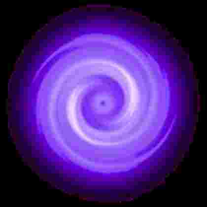

# Main
<!-- #SQUARK live!
| dest = .
-->

This image link should be rewritten to `/link.jpg`.

This image link should also be rewritten to `/link.jpg`.

This image link should be rewritten to `/nested/linked.jpg`.

This image link should also be rewritten to `/nested/linked.jpg`.

